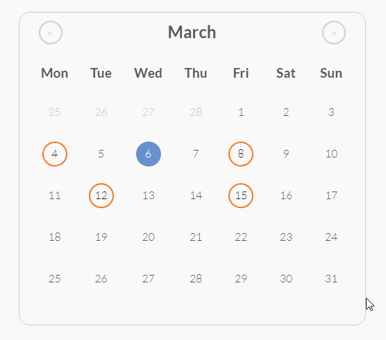

# Simple Calendar


A simple and easy plugin to create a calendar and add events to it.

## Usage

### Including files

You need to include :
- A recent version of [JQuery](https://jquery.com/)
- The javascript file ``jquery.simple-calendar.js``
- The stylesheet ``simple-calendar.css``

```html
<script src="http://ajax.googleapis.com/ajax/libs/jquery/1.11.1/jquery.min.js"></script>
<script type="text/javascript" src="jquery.simple-calendar.js"></script>
<link rel="stylesheet" type="text/css" href="simple-calendar.css" />
```

### Simple usage
Inside a ``$(document).ready();`` function you need to call the plugin on a container jquery element :
```javascript
$(document).ready(function(){
    $("#container").simpleCalendar();
});
```

### Events Preview


This initialize the calendar with its default settings.

### Usage with options

To customize its settings simply overwrite them like below :

```javascript
$(document).ready(function(){
    $("#container").simpleCalendar({
        //Defaults options below
        //string of months starting from january
        months: ['january','february','march','april','may','june','july','august','september','october','november','december'], //string of months starting from january
        days: ['sunday','monday','tuesday','wednesday','thursday','friday','saturday'], //string of days starting from sunday
        minDate : "YYYY-MM-DD", // minimum date
        maxDate : "YYYY-MM-DD", // maximum date
        insertEvent: true, // can insert events
        displayEvent: true, // display existing event
        fixedStartDay: true, // Week begin always by monday
        events: [], //List of events
        selectCallback: function (selDate) { }, // Callback on date select
        insertCallback : function(){} // Callback when an event is added to the calendar
    });
});
```

## updates
- 2019 September 25
> Fixed Date callback bug fix (thanks to **Franco Vilotta**)
> Added Year
> changed demo screen shot
